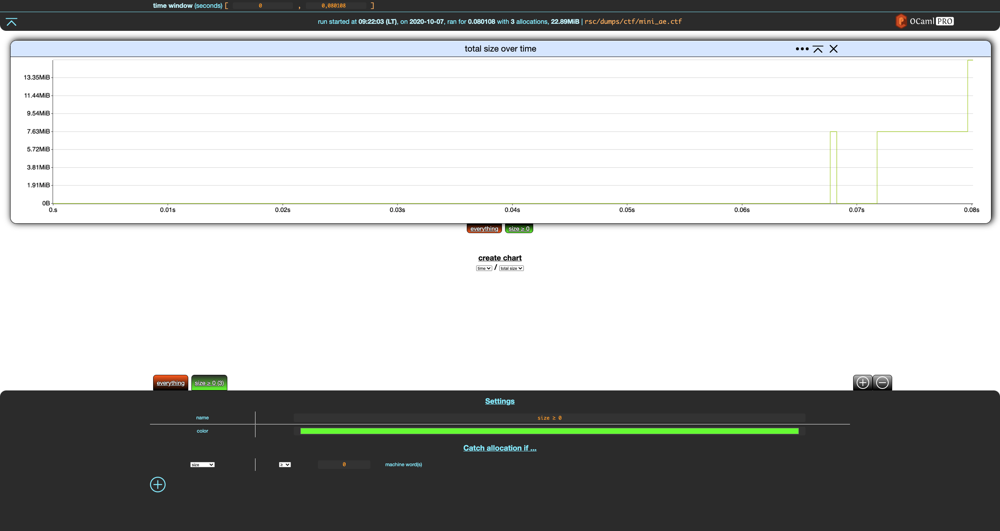
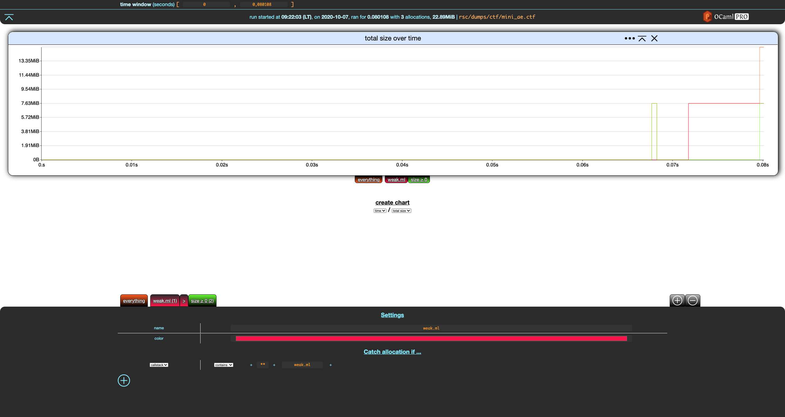
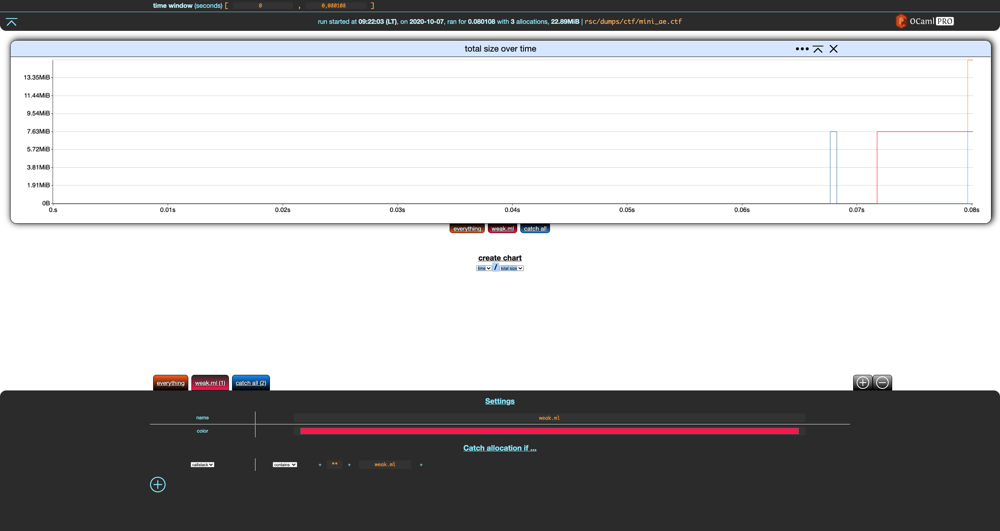
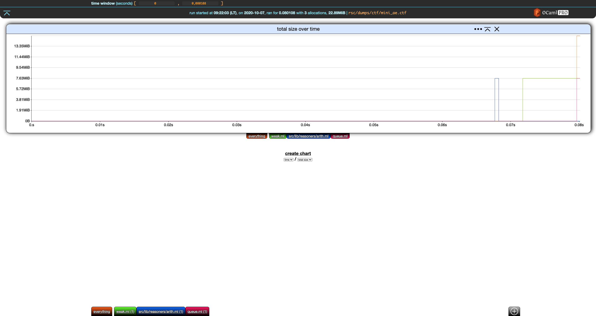

# Basics

Our running example in this section will be `rsc/dumps/mini_ae.ctf`:

```bash
❯ memthol --filter_gen none rsc/dumps/ctf/mini_ae.ctf
|===| Starting
| url: http://localhost:7878
| target: `rsc/dumps/ctf/mini_ae.ctf`
|===|

```

Notice the odd `--filter_gen none` passed to memthol. Ignore it for now, it will be discussed [later
in this section][filter gen].

Once memthol is running, `http://localhost:7878/` (here) will lead you to memthol's BUI, which
should look something like this:


\
\

Click on the orange **everything** tab at the bottom left of the screen.


\
\

Memthol's interface is split in three parts:

- the central, main part displays charts. There is only one here, showing the evolution of the
  program's total memory size over time based on the memory dump.

- the header gives statistics about the memory dump and handles general settings. There is currently
  only one, the *time window*.

- the footer controls your *filters* (there is only one here), which we are going to discuss right
  now.


## Filters

*Filters* allow to split allocations and display them separately. A filter is essentially a set of
allocations. Memthol has two built-in filters. The first one is the **everything** filter. You
cannot really do anything with it except for changing its name and color using the filter settings
in the footer.


\
\

Notice that when a filter is modified, two buttons appear in the top-left part of the footer. The
first reverts the changes while the second one saves them. Let's save these changes.


\
\

The **everything** filter always contains all allocations in the memory dump. It cannot be changed
besides the cosmetic changes we just did. These changes are reverted in the rest of the section.


## Custom Filters

Let's create a new filter using the `+` add button in the top-right part of the footer.


\
\

Notice that, unlike **everything**, the settings for our new filter have a **Catch allocation if
...** (empty) section with a `+` add button. Let's click on that.


\
\

This adds a criterion to our filter. Let's modify it so that the our filter catches everything of size greater than zero machine words, rename the filter, and save these changes.



The tab for our filter now shows **(3)** next to its name, indicating that this filter catches 3
allocations, which is all the allocations of the (tiny) dump.

\
\

Now, create a new filter and modify it so that it catches allocations made in file `weak.ml`. This requires

- creating a filter,

- adding a criterion to that filter,

- switching it from `size` to `callstack`

- removing the trailing `**` (anything) by erasing it,

- write `weak.ml` as the last file that should appear in the callstack.

After saving it, you should get the following.


\
\

Sadly, this filter does not match anything, although some allocations fit this filter. This is
because a **custom filter** `F` "catches" an allocation if

- all of the criteria of `F` are true for this allocation, and
- the allocation is not caught by any **custom** filter at the left of `F` (note that the
  **everything** filter is not a **custom filter).

In other words, all allocations go through the list of custom filters from left to right, and are
caught by the first filter such that all of its criteria are true for this allocation. As such, it
is similar to switch/case and pattern matching.

\
\

Let's move our new filter to the left by clicking the left arrow next to it, and save the change.



\
\

Nice.

\
\

You can remove a filter by selecting it and clicking the `-` remove button in the top-right part of
the footer, next to the `+` add filter button. This only works for **custom** filters, you cannot
remove built-in filters.

Now, remove the first filter we created (size ≥ 0), which should give you this:



\
\

Out of nowhere, we get the second and last built-in filter: **catch-all**. When some allocations are
not caught by any of your filters, they will end up in this filter. **Catch-all** is not visible
when it does not catch any allocation, which is why it was (mostly) not visible until now. The
filter we wrote previously where catching all the allocations.

> In the switch/case analogy, **catch-all** is the `else`/`default` branch. In pattern matching, it
> would be a trailing wildcard `_`.

So, `weak.ml` only catches one of the three allocations: **catch-all** appears and indicates it
matches the remaining two.


## Filter Generation

When we launched this section's running example, we passed `--filter_gen none` to memthol. This is
because, by default, memthol will run *automatic filter generation* which scans allocations and
generates filters. The default (and currently only) one creates one filter per allocation-site file.

> For more details, in particular filter generation customization, run `memthol --filter_gen help`.

If we relaunch the example without `--filter_gen none`

```bash
❯ memthol rsc/dumps/ctf/mini_ae.ctf
|===| Starting
| url: http://localhost:7878
| target: `rsc/dumps/ctf/mini_ae.ctf`
|===|

```

we get something like this (actual colors may vary):



[filter gen]: #filter-generation (Filter Generation Section)